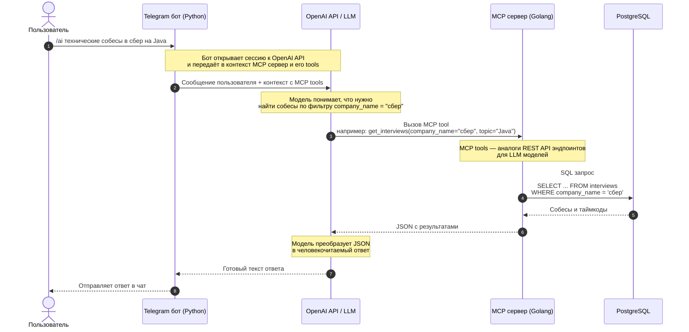

# 🤖 MCP/LLM для интеграции коллекции собеседований с ботом сообщества

В рамках сообщества по поиску работы собрана коллекция из 660 записей собеседований - скрининги, технические собеседования, финалы.

Во всём этом как-то нужно ориентироваться. Записи и таймкоды к ним выкладываются в чат менторства по трудоустройству, поэтому вопрос простейшей навигации по базе собеседований решает поиск Telegram - можно найти собеседования по названию компании, технические вопросы по конкретной технологии, и так далее.

Однако, ответы на более сложные вопросы по агрегации и анализу коллекции через поиск уже не получить:

- "Из всех "

Напрашивается решение, основанное на LLM. Задача - дать языковой модели доступ к базе собесов, чтобы она могла отвечать на вопросы по базе собесов и таймкодов. Интегрировать это с ботом сообщества.

## Примеры работы

## Архитектура решения

Основные компоненты:
- Телеграм бот на Python, с клиентом к LLM от OpenAI
- MCP сервер на Golang, с PostgreSQL базой, где лежат собесы и таймкоды. MCP - "REST API" для LLM моделей. Тулы (tools) MCP сервера (аналоги эндпоинтов в REST API) позволяют модели запрашивать у MCP сервера данные и исполнять действия
- Датасет (набор данных) в Google Spreadsheets. Туда люди, ответственные за пополнение коллекции собеседований, заносят собесы и вопросы с таймкодами. Датасет в таблице синхронизируется с SQL базой MCP сервера

Обработка запроса юзера, пошагово:
- Запрос в чате `/ai технические собесы в сбер на Java`
- Telegram бот обрабатывает команду, открывает сессию к OpenAI API (мы используем модели GPT 5.2 и 5.4). В сессии указан наш MCP сервер и его тулы
- LLM модель понимает, что ей нужно получить собесы с фильтром по названию компании, находит в списке тулов MCP нужный тул со списком параметров
- LLM модель вызывает тул, MCP сервер превращает аргументы запроса к SQL запрос (условно, `WHERE company_name = "сбер"`). Ответ на запрос к MCP тулу - JSON
- LLM модель формирует человекочитаемый текст на основе полученного JSON, бот отправляет его в чат

Ответ:

> Нашёл в базе 66 технических собеседований в Сбер/СберТех/дочках на Java (язык: русский). Ниже — список с датами и ссылками на записи.
> 
> • 2024-10-16 — Сбер — `https://t.me/c/********/****/****`
> 
> • 2024-06-20 — Сбер (оффер, 230000) — `https://t.me/c/********/****/****`
> 
> • 2024-05-31 — Сбер (оффер, 250000) — `https://t.me/c/********/****/****`
>
> ...

Шаги в виде mermaid диаграммы:

## Тегирование

## Борьба с переполнением контекста


